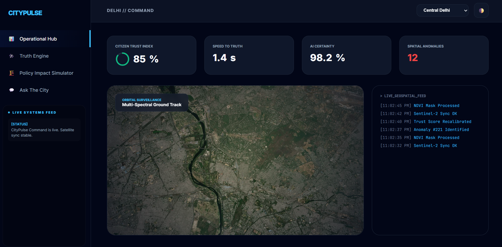

# 🚀 CityPulse: AI-Driven Predictive Governance

<div align="center">

<p align="center">
  
</p>


**PROJECT LINKS**

[Live Demo](https://harsha-jain64.github.io/CityPulse/) &nbsp;&nbsp;&nbsp;
[PPT Link](https://www.canva.com/design/DAG3YkYXf8M/jT50n2EH4quklZ9xemv22w/edit?utm_content=DAG3YkYXf8M&utm_campaign=designshare&utm_medium=link2&utm_source=sharebutton) &nbsp;&nbsp;&nbsp;
[Video Link](https://www.canva.com/design/DAG_t6tEzTE/PDN9H-kz34RdQ8V5ZB93AA/edit?utm_content=DAG_t6tEzTE&utm_campaign=designshare&utm_medium=link2&utm_source=sharebutton)

</div>

## CityPulse – The Digital Twin of City Governance
CityPulse is an end-to-end, role-based governance ecosystem that transitions city administration from **Reactive Management** to **Proactive Intelligence**. By integrating six specialized modules, it allows District Magistrates to interact with a "Living" digital twin of their city.


## 📖 Overview

In the current administrative setup, information is scattered. When a crisis hits—whether it’s a sudden power failure, a viral rumor, or a public grievance—policymakers often have to wait for manual reports from multiple departments. This creates a "Decision Gap."

CityPulse is designed to close that gap.

It acts as a single, high-level Command Center that looks at the city’s health in real-time.


## 🌟 The Core USP (Unique Selling Propositions)

1. **The Truth Engine (Rumour Verification):** A real-time NLP layer that cross-references social media trends with official government records to debunk misinformation before it scales.
2. **Policy Impact Simulator:** A "What-If" engine that allows planners to simulate the socio-economic impact of a new policy (e.g., a new flyover or tax) before implementation.
3. **Ask The City (Semantic Search):** A Generative AI interface that allows citizens to query complex municipal bylaws and schemes using natural language.

## 📖 The 6-Module Architecture

### 🛡️ 1. Truth Engine
Combines web scraping and NLP to categorize city-wide news as *Verified*, *Unverified*, or *Rumour*, protecting the city from digital panic.

### 📈 2. Policy Impact Simulator
Uses historical data and predictive modeling to visualize how policy changes affect different demographics across the district.

### 🤖 3. Ask The City
A RAG-based (Retrieval-Augmented Generation) chatbot trained on local government gazettes to provide instant, accurate policy support.

### 📝 4. Urban Reports
A crowdsourced "Civic-Action" portal where citizens report infrastructure failures with geolocation, categorized by AI for priority.

### 🔔 5. Lighting Alerts
A centralized notification hub that broadcasts hyper-local emergency alerts, weather warnings, and scheduled utility maintenance.

### ⚡ 6. Energy Demand Spike
A predictive grid monitor that uses **Satellite Thermal LST** data to forecast energy surges and prevent transformer failures.

## 🛠️ Unified Tech Stack

**Frontend & Visuals:**
* [](#)
* [](#)
* [](#)
* [](#)

**Intelligence & Backend:**
* [](#)
* [](#)
* [](#)

**Data & Infrastructure:**
* [](#)
* [](#)

## 🚀 Vision for National Security & Governance
CityPulse aligns with the **National e-Governance Plan (NeGP)**, focusing on reducing the "Decision Latency" of the government. By providing a unified dashboard, we eliminate the need for inter-departmental manual reporting, replacing it with a **Live Governance Stream**.

**🔒 Access Restricted to Authorized Personnel Only.**


## 🖥️ Screenshots

<p align="center">
  
  <br/>
  <i>Homepage</i>
</p>

<br>

<p align="center">
  
  <br/>
  <i>Policy Impact Simulator - Predictive Modeling, Risk Assessment, Strategic Forecasting, Decision Validation</i>
</p>

<br>

<p align="center">
  
  <br/>
  <i>Ask The City – Factual Accuracy, Knowledge Synthesis, and Protocol Intelligence</i>
</p>


## 📁 Project Structure

```
UrbanPulse_Admin/
├── core_command/        # Central Hub: Unified policymaker entry point
├── truth_engine/        # NLP Logic: Misinformation & Sentiment analysis
├── policy_simulator/    # Analysis Logic: Predictive impact modeling
├── admin_llm/           # RAG Engine: Knowledge base for legal/protocol queries
├── auditor_reports/     # Backend: AI-clustered infrastructure verification
├── broadcast_node/      # Push System: Emergency notification dispatcher
├── thermal_grid/        # Satellite Logic: Real-time energy spike forecasting
├── assets/              # UI Assets: Tactical maps, logos, and icons
└── config/              # Security: Access controls and API environment
```


## 🚀 Deployment

### Production Build
To prepare the application for production:
```bash

```
It is recommended to use a process manager like PM2 or deploy on platforms like Heroku, Vercel (for frontend if separated), or a custom VPS with Nginx for reverse proxying for robust production deployment.


## 🤝 Contributing

We welcome contributions to CityPulse! If you have suggestions for improvements or want to report a bug, please open an issue or submit a pull request.


## 🙏 Acknowledgments

-  **MeitY**: For providing the framework for Smart Governance.

-  **ISRO / NASA**: For the Land Surface Temperature (LST) datasets.

-  **OpenAI/Anthropic**: For the semantic LLM capabilities.

-  **Leaflet.js**: For providing the GIS mapping foundation.

<div align="center">


**⭐ Star this repo if you find it helpful!**

Made with ❤️ by IDEASPRINT
